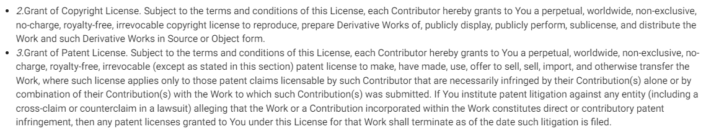
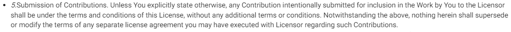

# CLA对开源社区的重要性

## 什么是CLA
- CLA（**Contributor License Agreement**）顾名思义，是具有法律效应的贡献者许可协议。其目的是确保项目组织对所有贡献拥有必要的著作与专利许可权，以允许项目组织可以对项目进行分发，通常通过授予不可撤销的许可来允项目组织使用贡献。

    CLA分为 ICLA（**Individual CLA**）与 CCLA（**Corporate CLA**），目前社区里的CLA大部分是根据[ASF(Apache Sofware Foundation)的CLA][1]进行衍生，各个项目组织根据需求进行定制化。但共同的特性是都包含以下几点：

>- 关于签署该 CLA 的主体和贡献的定义
>- 授予著作权许可给拥有该软件知识产权的公司或组织
>- 专利许可的授予
>- 签署者保证依法有权授予上述许可
>- 签署者对属于原创内容贡献的保障
>- 说明贡献者提交非原创作品应该采用的方式
>- 签署者无需为贡献内容提供支持的免责描述
>- 保证在获悉任何方面不准确的事实或情况之时通知签约方

- 虽然ICLA与CCLA在内容上基本一致，但是签署时所需要的信息是不一致的。ICLA通常需要签署者提供个人信息（姓名、邮箱、联系电话等），对于CCLA通常需要提供公司信息（公司名称、地址、联系电话、邮箱、传真等）。考虑到数据的真实性，ICLA里姓名与邮箱是必选的，CCLA里公司名称与邮箱则是必选，同时，对于邮箱的真实性要进行验证。此外，签署CCLA时，往往需要公司维护白名单，该白名单中的用户的贡献都会得到通过。

对于各个项目组织维护在不同平台如Github、Gitee以及自己构建的平台如Apache等则会在CLA签署里会增加其平台账号的信息。以下是部分社区的CLA对照表格：

<table>
	<tr>
	    <th></th>
	    <th>指定贡献内容的许可证</th>
	    <th>著作权、专利授权类型</th>
        <th>是否定义退出规则</th> 
        <th>合法授权</th> 
        <th>原创性</th>
        <th>提交非原创作品方式</th>
        <th>无需为贡献内容提供支持的免责声明</th>
        <th>变更通知</th>
        <th>ICLA签署必选项</th>
        <th>CCLA签署必选项</th>
	</tr >
	<tr >
	    <td>openEuler</td>
	    <td>×</td>
	    <td>永久、不可撤销</td>
        <td>×</td>
        <td> ✔ </td>
        <td> ✔ </td>
        <td> ✔ </td>
        <td> ✔ </td>
        <td> ✔ </td>
        <td> 姓名、邮箱、Gitee-ID </td>
        <td> 公司名称、邮箱、授权代表、职位</td>
	</tr>
	<tr>
	    <td>Apache</td>
	    <td>×</td>
	    <td>永久、不可撤销</td>
        <td>×</td>
        <td> ✔ </td>
        <td> ✔ </td>
        <td> ✔ </td>
        <td> ✔ </td>
        <td> ✔ </td>
        <td> 姓名、邮箱、 </td>
        <td> 公司名称、邮箱、地址、电话、传真</td>
	</tr>
	<tr>
	    <td>阿里</td>
	    <td>×</td>
	    <td>永久、不可撤销</td>
        <td>×</td>
        <td> ✔ </td>
        <td> ✔ </td>
        <td> ✔ </td>
        <td> ✔ </td>
        <td> ✔ </td>
        <td> 姓名、邮箱、地址、电话 </td>
        <td> 公司名称、邮箱、授权代表、职位、地址、国家、电话</td>
	</tr>
	<tr>
	    <td>Google</td>
	    <td>×</td>
	    <td>永久、不可撤销</td>
        <td>×</td>
        <td> ✔ </td>
        <td> ✔ </td>
        <td> ✔ </td>
        <td> ✔ </td>
        <td> ✔ </td>
        <td> 姓名、邮箱、</td>
        <td> 公司名称、邮箱、地址、国家、电话、授权签字人、授权管理贡献者列表人</td>
	</tr>
	<tr>
        <td>Microsoft</td>
	    <td>×</td>
	    <td>永久、不可撤销</td>
        <td>×</td>
        <td> ✔ </td>
        <td> ✔ </td>
        <td> ✔ </td>
        <td> ✔ </td>
        <td> ✔ </td>
        <td colspan=2> 个人签署：GitHub ID、名字、邮箱 
                    代表雇主签署：公司名称、GitHub ID、名字 无区分Individual与Corporate</td>
	</tr>
	<tr>
	    <td>Mozilla(Committer’s Agreement)</td>
	    <td>贡献者必须在MPL-2.0或Mozilla可接受的许可集里的许可证下进行贡献</td>
	    <td>与贡献许可证相关</td>
        <td>×</td>
        <td> ✔ </td>
        <td> ✔ </td>
        <td> ✔ </td>
        <td> ×</td>
        <td> ×</td>
        <td colspan=2> 姓名、邮箱、电话、地址 无区分Individual与Corporate</td>
	</tr>
	<tr>
	    <td>Fedora(Fedora Project Contributor Agreement)</td>
	    <td>贡献者可以在指定的许可证列表里选择许可贡献,如若没有指定则使用Fedora默认许可(MIT、CC-BY-SA 4.0)</td>
	    <td>与贡献许可证相关</td>
        <td>×</td>
        <td> ✔ </td>
        <td> ✔ </td>
        <td> 对于非原创的作品都不认为是贡献</td>
        <td> ×</td>
        <td> ×</td>
        <td colspan=2> 姓名、邮箱 无区分Individual与Corporate</td>
	</tr>
	<tr>
	    <td>W3C</td>
	    <td>×</td>
	    <td>永久、有限时间可撤销</td>
        <td>贡献45天内可以撤销</td>
        <td> ✔ </td>
        <td> ✔ </td>
        <td> ✔ </td>
        <td> ×</td>
        <td> ✔ </td>
        <td colspan=2> 姓名、邮箱 无区分Individual与Corporate</td>
	</tr>
</table>

从表格里我们可以看出，Mozilla与Fedora社区的贡献者协议不同于传统的CLA，他们更清晰的定义了贡献内容的license范围，同时对于“贡献”的定义，[Fedora][3]认为非贡献者原创作品都不包括在该定义中。对于社区项目来源有上游社区项目、上游社区项目改编与自研项目。我们知道当前大多数开源代码都遵循inbound=outbound 贡献策略，Fedora在遵循此策略情况上，其贡献者协议的目的是对社区自研项目的license的一个补充说明，来确保新的inbound具有社区可接受的license。

  

## 为什么要签署CLA
- 我们都知道开源社区里版权、专利等合规问题无处不在。对于一个项目，您将需要确保所有相关方都受到版权和知识产权法的保护。那么，如果您没有贡献者许可协议，会发生什么？尽管出于职业礼貌，人们普遍认为，项目贡献者拥有其贡献的版权，但如果没有签订贡献者许可协议，则未来很可能会出现问题：

>- **项目的版权归属问题？**
>- **贡献者在贡献时是否侵犯了版权？**
>- **贡献者是否被允许贡献？**

这时候有一个清晰简洁的贡献者许可协议可以保护组织和贡献者免受未来有关知识产权的问题或拒绝使用所贡献的材料的影响。时常能看到业界有各种版权/专利纠纷案，CLA在版权/专利纠纷案中往往能起到关键性作用。

>**对于组织：** 降低合并他人代码的风险。虽然大部分贡献内容都带有License（文件的头部注释），但大部分License并未表明永久的许可，CLA通过补充永久性的版权许可能有效避免贡献者撤销所贡献的代码，当然，也可以考虑像W3C一样，在规定的时间内为贡献者提供撤销的权力，对贡献者来说，会更加的人性化，对组织来说也会吸引更多的贡献者。专利的许可能避组织陷入专利侵权案，同时原创声明能有效的解决组织陷入版权纠纷案中。另一方面，如果组织考虑更改项目的License,合法的解决方法是获取所有贡献者的批准，但是如果项目组织已经签署了CLA，则无需再花费大量时间在追踪贡献者上面。

>**对于贡献者：** 保护了贡献者的版权与专利，确保了贡献内容不会被他人用在非法盈利用途之上，同时贡献者无需对贡献内容提供支持。
CLA内容除了上诉之外，是否还有其他方面？对于不同的组织，不同需求，可以在CLA中适当定制化来对项目的License进行补充。比如可以在CLA中增加维权的限制条件等，就从前不久 [Patrick McHardy 事件][4]里，McHardy 与 Netfilter 达成的和解协议里表明任何与 Netfilter 相关的版本维权活动的决策都应该基于该核心团队成员的多数投票，我们知道目前License基本上是没有关于维权的信息，如果将这种维权的方式补充到CLA内，我想就能有效的避免类似此类事件的发生。

  
 ## 简化版CLA

- DCO（Developer Certificate of Origin）， 由Linux Foundation 于 2004 年制定。与CLA相比，DCO 最大的优点是可以减轻开发者贡献的阻碍，只需要在每次提交的贡献内容的时候签署邮件地址即可。同时DCO没有冗长的 CLA 法律条文，也不支持定制化。目前[DCO][5]最新为1.1版本，贡献者只需要保证固定以下四点：

> - **贡献全部或部分由我创建，并且我有权根据文件中指明的开源许可提交；或者**
> - **贡献是基于以前的工作，这些工作属于适当的开源许可，无论这些工作全部还是部分由我完成，我有权根据相同的开源许可证（除非我被允许根据不同的许可证提交）提交修改后的工作；或者**
> - **贡献是由其他人直接提供给我，该人证明1、2、或 3 ，并且我没有对其进行修改；**
> - **我理解并同意该项目和贡献是公开的，并且该贡献的记录（包括我随之提交的所有个人信息，包括我的签字）被无限期保留，并且可以按照此项目或涉及的开放源码许可进行重新分发；**

- 从CLA与DCO的内容与签署方式里不难看出，CLA的优势在于签署为一次性，而DCO则是每次commit都需要签署，CLA在法律上有明确法律义务，DCO则是用来限制贡献者遵守开源License，并未明确法律义务。在版权专利许可上，DCO需要根据项目的License而定，对此我们可以认为对于更加注重个人贡献的项目，可以考虑使用DCO，但是对于大型合作型项目，建议使用CLA。

    当然这里还需考虑一些项目本身License已经包含了版权和专利许可的表述，如[Apache-2.0][6]里有明确表明贡献者授予的版权与专利许可。

    
    

    对于此类型项目是否还需要签署CLA？我想是需要的，因为该类License仅仅只是表明了版权专利的许可，但并未表明贡献者的原创性，这难免会造成一些贡献者将非原创作品进行贡献，导致组织陷入版权专利的纠纷案。当然也可以考虑此类项目结合DCO进行限制，因为DCO条文里有明确规范原创性问题，在此情况下DCO与项目License的结合基本能涵盖传统CLA的内容。

    |    |CLA|DCO|Apache-2.0|GPLv2|MIT|
    |:----|:----:|:----:|:----:|:----:|:----:|
    |版权许可|✔|✖|✔|✔|✖|
    |专利许可|✔|✖|✔|✔|✖|
    |许可条件|✖|✖|✔|✔|✖|
    |原创性说明|✔|✔|✖|✖|✖|
    |非原创性作品贡献说明|✔|✔|✖|✖|✖|

    从上诉表格中我们也可以看出，贡献者许可协议是可以作为项目License的一个补充条款，它们相互填补了空白，环环相扣，形成了一个强大的开源软件的知识产权管理系统。

    

 

[1]:https://www.apache.org/licensescontributor-agreements.html

[2]:https://fedoraproject.org/wiki/Legal:Fedora_Project_Contributor_Agreement?rd=Legal:FPCA

[3]:https://fedoraproject.org/wiki/Legal:Fedora_Project_Contributor_Agreement?rd=Legal:FPCA

[4]:https://mp.weixin.qq.com/s/eKB4bCEe1s6TrrJCFgnMig

[5]:https://developercertificate.org

[6]:https://spdx.org/licenses/Apache-2.0.html