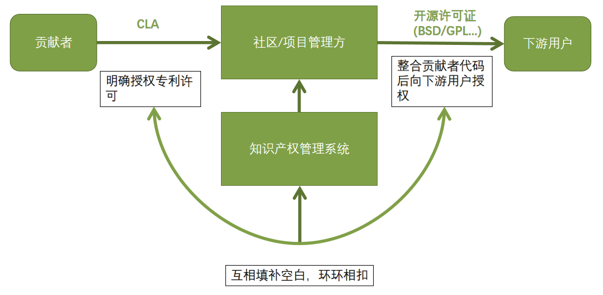

# CLA：减少开源社区合规风险的银弹？

作者：陈一雄、郑志鹏

## 什么是CLA, 业界使用CLA的实践介绍

CLA（**Contributor License Agreement**）顾名思义，是具有法律效应的贡献者许可协议。其目的是确保贡献者拥有的著作权与专利许可权被合理、充分、不可撤销的授权给项目管理组织以及项目的使用者。

目前社区里的CLA大部分是根据[ASF(Apache Sofware Foundation)的CLA][1]衍生的，各个项目管理组织根据自身需求进行定制化。以下是部分社区的CLA对照表格：

|    |**明确**涉及的主体和主要行为的**定义**|**明确的**著作权与专利**授权**|贡献者**原创性保证**|**明确**贡献者提交非原创作品方式|**明确**贡献者无需为贡献内容提供任何的支持和保证的**免责声明**|**明确**导致上述保证变化的情况需及时**通知**签约方|指定贡献内容的许可证**范围**|是否定义该协议的退出规则|
|:----|:----|:----|:----|:----|:----|:----|:----|:----|
|openEuler|✔|永久、不可撤销|✔|✔|✔|✔ |✖ |✖|
|Apache|✔|永久、不可撤销|✔|✔|✔|✔|✖ |✖|
|阿里|✔|永久、不可撤销|✔|✔|✔|✔|✖ |✖|
|Google|✔|永久、不可撤销|✔|✔|✔|✔|✖ |✖|
|Microsoft|✔|永久、不可撤销|✔|✔|✔|✔|✖ |✖|
|Mozilla(**Committer’s Agreement**)|✔|与贡献许可证相关|✔|✔|✖  |✖  |贡献者必须在MPL-2.0或Mozilla可接受的许可集里的许可证下进行贡献|✖|
|Fedora(**Fedora Project Contributor Agreement**)  |✔|与贡献许可证相关|✔|对于非原创的作品不认为是FPCA里定义的贡献内容，需采用不同的方式提交|✖  |✖  |贡献者可以在指定的许可证列表里选择许可贡献,如若没有指定则使用Fedora默认许可(MIT、CC-BY-SA 4.0)|✖|
|**W3C**|✔|永久、有限时间可撤销|✔|✔|✖|✔|✖|贡献45天内可以撤销|

从表格里我们可以看出：大部分CLA都是对License中的核心的名词定义、授权的范围、贡献是否原创进行了明确。但也有一些有趣的区别，Mozilla与Fedora社区的贡献者协议相对于其他的CLA，他们定义了贡献内容的License范围，有利于减少社区License的种类。同时，[Fedora][2]认为非贡献者原创作品都不包括在“贡献“的定义中，因此需要采用不同的方式提交非原创内容。

## 我们对CLA的理解，以及为什么需要CLA？

我们都知道开源社区里版权、专利等合规问题无处不在。对于一个项目，您将需要确保所有相关方都受到版权和知识产权法的保护。

但对于版权专利的保护通常不是依靠开源的License，如著名的Apache-2.0、 MIT、 GNU GPLv2吗？CLA与License之间是什么关系？

我们认为：**CLA是License的明确和补充。它降低很多措辞的模糊性带来相关法律风险，同时对License未覆盖到部分的权利义务关系进行了补充。**

很多流行的开源License，它们依赖职业礼貌、道德和黑客价值观对著作权和专利权的授权进行说明，并没有清晰的定义。如MIT总共只有167个词。

而使用CLA，可以在保留使用流行License的基础上，对License中没有明确说明的部分加以明确，大大减少以下法律争议发生概率：

* **贡献者的贡献内容是否是永久的不可以撤销的。**
* **贡献者是否在版权授权的同时进行了专利授权。**
* **贡献者在贡献时如果侵犯了第三方的版权，作为项目的分发方，能否减少和转移自己需要承担法律责任和风险。**
* **其他内容可参考前文表格**

实践中时常能看到业界有各种版权/专利纠纷案，CLA在版权/专利纠纷案中往往能起到关键性作用。

* **对于组织：**虽然大部分贡献内容都带有License（文件的头部注释），但大部分License并未**明确**表明许可是永久的，CLA补充了授权的永久性，和不可撤销性。**明确**的专利的许可能避组织陷入专利侵权案，原创声明帮助组织在发生对第三方的版权侵权时，转移责任和降低风险。同时，签署CLA也能留下所有贡献者的联系方式，在某些情况下可以更容易的联系到所有贡献者。这些对组织来说都是有利的。
* **对于贡献者：明确**了自己是否转移了版权还是只是进行了授权，明确了贡献被授权的范围（如：不能用在非法用途上），同时**再次明确**贡献者无需对贡献内容提供支持，承担责任（虽然这部分内容一般也会被大多数License包含）。

## 我们对CLA应用的潜力的思考：

既然CLA是对License的补充，我们认为除了在License之内的其他约定都可以放入CLA中，包括：

* 对License中模糊和有争议的内容的清晰定义和进一步明确。
* **版权转移规则**：通常来说对开源项目的贡献无论大小，都将使贡献者成为项目的版权人之一。但副作用是某一个项目的版权人数量激增，这个在实践中会给除了版权授权（License的主要内容）以外的其他版权活动（如版权维权，版权转移等）带来很大的困难。可以制定**少量**贡献的版权转移给主要版权人的规则，CLA就是最适合放置该规则的地方。
* **License变更规则**： 在传统上，License变更需要获取全体版权人一致同意，这在开源项目实践中往往也非常困难，可以在CLA 中增加License变更的相关规则，如超过80%的“主要贡献者”同意，并定义主流贡献者来解决这个问题。
* **License维权规则**：面对License遵从侵权，可以预先定义一套维权的规则，保证整个维权行为符合项目主要版权人的共同利益和项目价值观。如同前不久 [Patrick McHardy 事件][3]里，McHardy 与 Netfilter 达成的和解协议里：要求任何与 Netfilter 相关的版本维权活动的决策都应该基于该核心团队成员的多数投票。这样的内容如果提前出现在CLA里面，就可以避免整个争议事件，减少事件产生的不良影响。
目前业界对CLA的应用主要还是集中在第1点，伴随着开源开发模式流行，我们认为CLA作为其有力的开源法律工具，有极大的潜力可挖掘，必将为开源世界的发展繁荣发挥更大的作用！

## 我们对CLA在开源社区实践：

openEuler作为国内基础软件的根社区之一，也率先构建了CLA能力并进行了实践。当然我们希望进一步发展挖掘CLA的潜力，优化CLA签署和管理的体验。有兴趣的读者可以联系openEuler合规SIG组和基础设施SIG组参与讨论和后续优化。

[1]:https://www.apache.org/licensescontributor-agreements.html

[2]:https://fedoraproject.org/wiki/Legal:Fedora_Project_Contributor_Agreement?rd=Legal:FPCA

[3]:https://mp.weixin.qq.com/s/eKB4bCEe1s6TrrJCFgnMig

