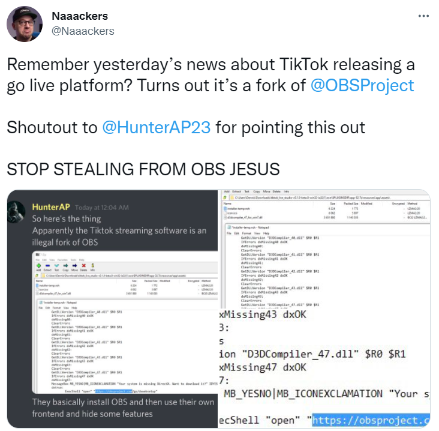
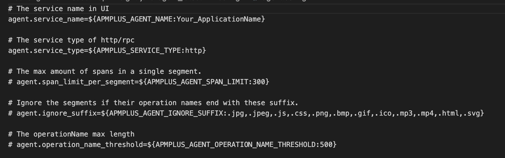
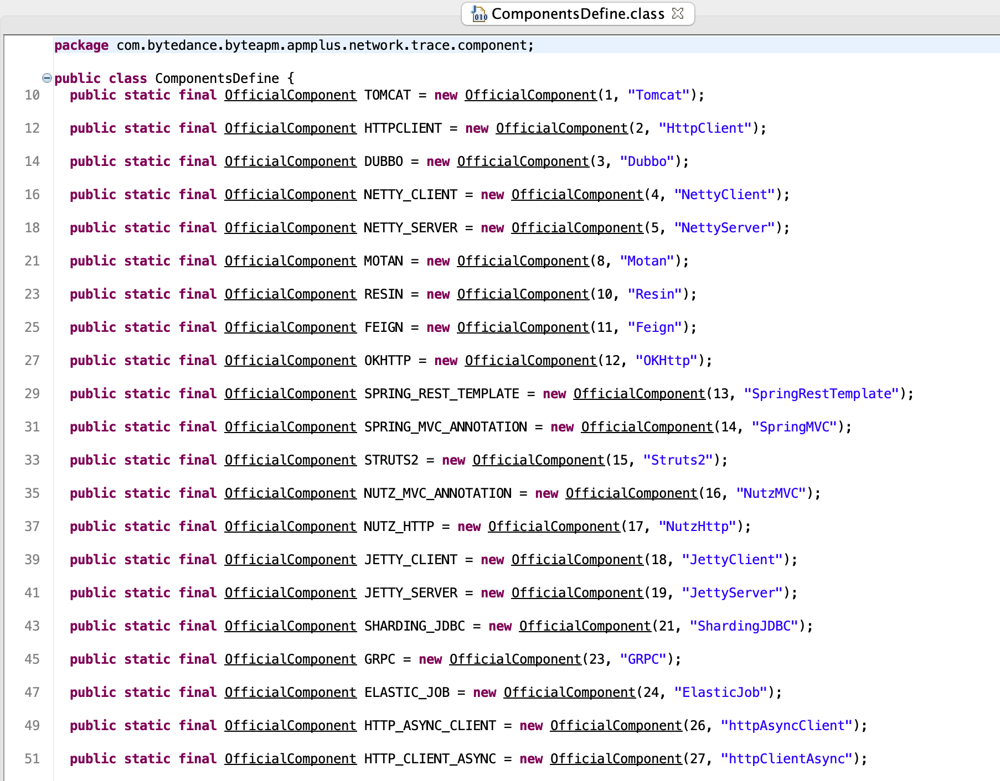
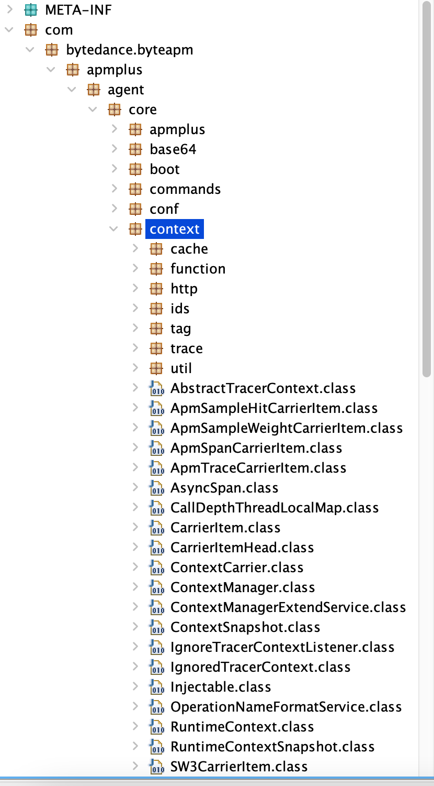
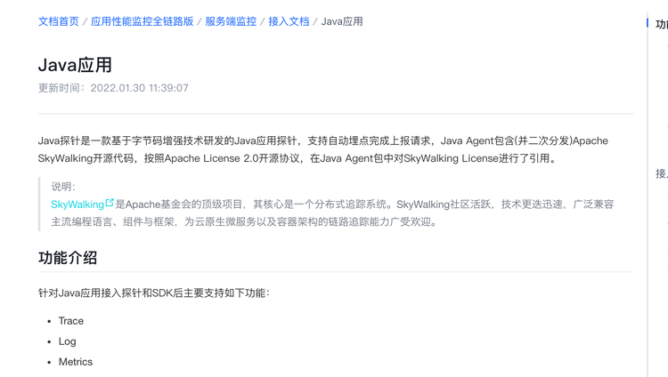
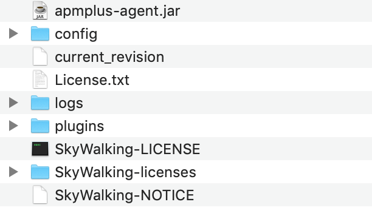
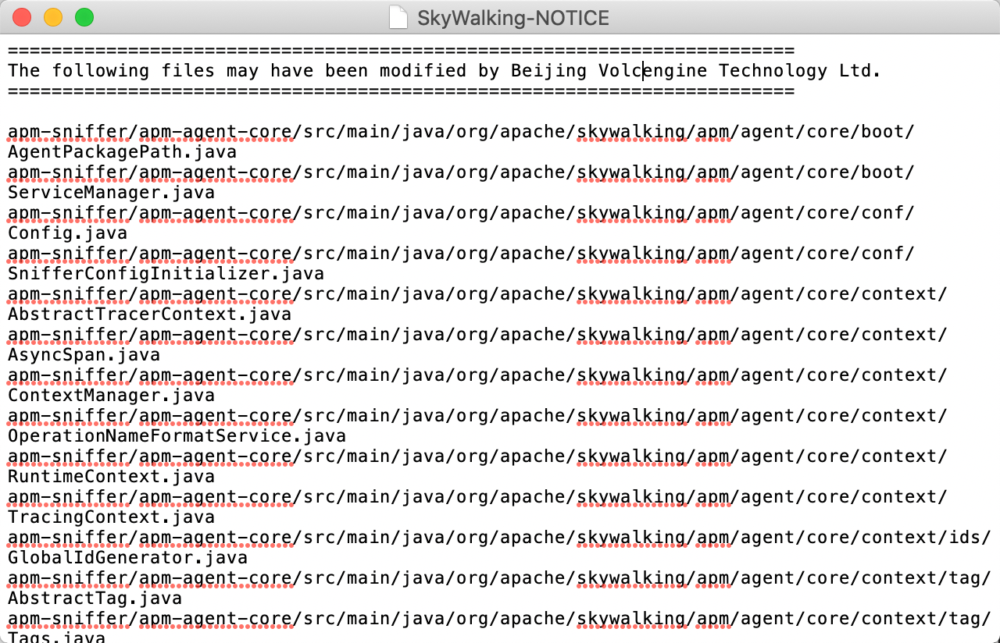

>### 海外TikTok违反GPL协议

- 2021年12月，TikTok发布了Live Studio —— 一款用于Windows的桌面直播程序。在其发布不久后，被曝出代码使用了OBS（**Open Broadcaster Software**）的代码。

    

- OBS是一款用于截屏和直播的免费开源应用程序，基于GPLv2协议进行发布，对于开源项目，Live Studio如果合规的使用OBS代码进行衍生分发，也就是遵循GPLv2协议的义务，也就不会有问题。但是，Live Studio并没有履行GPLv2的义务，将代码进行开源。

- OBS 的业务开发人员 Ben Torell 随后回复了该推文，表示同意，但指出 OBS 对与 TikTok 合作持开放态度：“我们承诺真诚地处理违反 GPL 的行为，就 TikTok/字节跳动而言只要他们遵守许可，我们很乐意与他们建立友好的工作关系。”

- 目前 TikTok 已删除 TikTok Live Studio 的发布/下载页面，且并未对此事作进一步回应。OBS 团队正在积极联系 TikTok 相关人员，以协商 OBS 的 GPL 许可证相关事宜。

> ### Volcengine Inc违反Apache-2.0

- Volcengine Inc.(火山引擎) Application Performance Monitoring - Distributed Tracing (应用性能监控引擎全版)是根据Apache SkyWalking进行衍生分发。

- Apache SkyWalking 是 ASF(**Apache Software Foundation**)下的一个顶级项目，是一款用于分布式系统应用程序性能监控的开源软件。

- 2022年1月28日，SkyWalking收到了一位提交者以匿名方式举报火山引擎违反许可证的报告。。火山引擎有一项云服务，名为Application Performance Monitoring - Distributed Tracing（应用性能监控全链路版）。在Java服务监控部分，它提供了这个代理下载链接：
wget https://datarangers.com.cn/apminsight/repo/v2/download/java-agent/apminsight-java-agent_latest.tar.gz

- 随后SkyWalking团队对其进行验证并确认这是SkyWalking java代理的版本，并列出的一些证据来证明。
 
  1.第一个是agent.config文件，Volcengine与它使用相同的配置键和相同的配置格式。

  这是Volcengine的版本,查看[SkyWalking agent.config][1]

    

  2.SkyWalking提到在apmplus-agent.jar Volcengine 的代理核心 jar 中，可以轻松找到与 SkyWalking 完全相同的几个核心类。

    ComponentsDefine类没有改​​变，即使有组件 ID 和名称。这是 Volcengine 的版本，查看[SkyWalking 的版本][2]

    

  3.SkyWalking提到 Volcengine的整个代号、包名、层次结构都与SkyWalking 6.x版本相同。

    这是Volcengine包的层次结构，查看[SkyWalking的版本][3]

    

- Volcengine 的团队更改了所有包名称，删除了 ASF 的标头，并且在重新分发时不保留 ASF 和 Apache SkyWalking 的 LICENSE 和 NOTICE 文件。到这里可以明显的看出 Volcengine 违反了 Apache 2.0 License ,对此 SkyWalking 团队也联系了 Volcengine 的律师团队进行沟通。

- 2022年1月30日晚上，Volcengine 团队作出回应，其承认了违规行为，并更新了其项目

    1.Volcengine 的 APMPlus 服务页面于 1 月 30 日更新，并表示该代理是 Apache SkyWalking 代理的 fork 版本（重新分发）。

    

    2.Volcengine 的 APMPlus 代理分发也已更新，现在包括 SkyWalking 的许可证和通知。

    

    3.Volcengine 的 APMPlus 团队已经在agent中恢复了SkyWalking的所有license header，项目文件的修改也在“SkyWalking-NOTICE”中列出。

    

>   **对于这这两件违规案例里，我们可以看到对于开源的项目使用是需要建立在合规的基础之上，项目在入口到出口这条供应链上需要做好自我的审查。**
> 
>   **同时从OBS与SkyWalking的处理方式可以看出，他们更多的是以以开发与包容的思想来运营开源社区，在遇到违规行为时，是先沟通而不是通过法律执行维权行为。**

  [1]:https://github.com/apache/skywalking-java/blob/395ce4f86ae14cf24af489a6aa7e849b1d9a27ed/apm-sniffer/config/agent.config

  [2]:https://github.com/apache/skywalking-java/blob/395ce4f86ae14cf24af489a6aa7e849b1d9a27ed/apm-protocol/apm-network/src/main/java/org/apache/skywalking/apm/network/trace/component/ComponentsDefine.java

  [3]:https://github.com/apache/skywalking-java/tree/v6.6.0/apm-sniffer/apm-agent-core/src/main/java/org/apache/skywalking/apm/agent/core/context