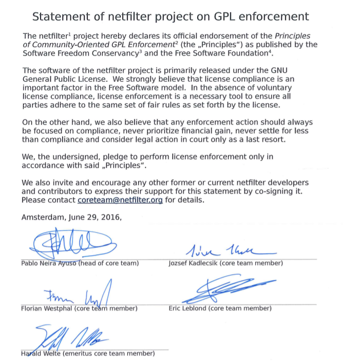

## Patrick McHardy事件最终和解带来的思考

> ### 事件背景
- Netfilter 是一个社区驱动的协作 FOSS 项目，最初由 Paul Rusty Russell 于1998年创立，随着项目的发展，他在 1999 年成立了 Netfilter 核心团队。该项目为 Linux2.4.x 及之后的版本内核系列提供网络包过滤软件，通常与 Iptables 相关联，作为 Linux 内核中的一个模块。手机，智能手表，路由器等终端和网络设备的企业都会使用Linux来开发，如小米、OPPO、华为、思科、爱立信都可能会使用到Netfilter。

- Patrick McHardy 对 Netifilter 项目代码库具有持续重要的贡献，于2004年1月被邀请加入其核心团队。在接下来几年里，McHardy 领导团队开发，并于2007年7月被选为核心团队的新主席。但是由于 McHardy 没有签署 [The Principles of Community-Oriented GPL Enforcement][2] ,于2016年6月被停职，并删除其贡献账号。

    **The Principles of Community-Oriented GPL Enforcement** 是由FSF ( **Free Software Foundation** )与SFC ( **Software Freedom Conservancy** )在2015年发布面向社区的 GPL 维权的原则，该原则皆在使版权许可的维权首先服务于保护用户自由的目标，提倡将法律行动视为最后手段，永远不要把经济利益置于保护用户自由之上。从 McHardy 不签署该维权原则的声明可以猜想他也许更愿意走跟该原则相反的道路。
    
    

    在 McHardy 被停职之后，他在18个月内以不遵守 GPL 为由联系了德国的许多企业要求赔偿，其金额达到了200万欧元。该金额仅仅统计了在德国的判决和和解协议里公开的赔偿金额，相信总共的赔偿金额远不止如此。客观分析：这些行为有一定的正面意义，它们是增加了企业对开源License遵从，甚至是对整个开源文化的重视。但以追求经济利益为目的，提出过高的经济赔偿要求，对开源界带来了更多的伤害。对于企业来说，使用开源如果有巨大的经济赔偿的潜在“风险”，会削弱它们使用开源，甚至是贡献开源的积极性。同时对于那些抱着要捍卫“所有计算机用户的自由”或者“所有人都可以分享开源软件的自由和机会”信念的开发者，想到自己的才智贡献可能会被其他开发者用户追求个人的经济利益，也会大大削弱他们参与开源贡献积极性。
    
    因此，上述行为招致了 Netfilter 项目的公开反对。在2016年7月份，SFC 的 Karen Sandler 和 Bradley Kuhn 发表了一篇以 McHardy为 主题的博客[文章][4]，文章透露出 SFC 鼓励 McHardy 与他们共同起草并签署遵从 **The Principles of Community-Oriented GPL Enforcement** 的声明，但没有收到他的回应，同时谴责 McHardy 拒绝支持这些维权原则但没有公开证明他通过诉讼来对GPL进行维权行为的正当性。基于 Netfilter 项目对于 Linux 内核的作用，这事件可能会导致越来越多的企业停用 Linux 。

    期间 Netfilter 项目以拒绝遵守 **The Principles of Community-Oriented GPL Enforcement** 的原则为由封掉了 McHardy 的账号，并尝试联系 McHardy 讨论他的活动，但没有得到回应。项目团队决定在2020年对 McHardy 提起诉讼。在2021年的诉讼期间与 McHardy 的联系恢复，最终于2022年1月宣布达成了一项具有法律约束力的[和解协议][3]。

    

- 该和解协议明确不允许单独个人进行版权维权。它规定，任何与 Netfilter 相关的版本维权活动的决策都应该基于该核心团队成员的多数投票。该和解涵盖过去和新的维权活动，对于过去的 McHardy 的维权案例，包括谈判中、已达成协议未执行赔偿与已达成协议拒绝执行赔偿的都将作废。

   但从和解协议里对于核心团队成员的多数投票并没有看到明确的规定，而是一个相对模糊的概念，例如作为软件的被许可方如果发现自己被版权人（共同协作项目的一方）起诉侵犯版权，可能会反对起诉方未达成多数投票。

> ### 开源社区影响
- 从这个事件上我们看到了一些正向的文化：Netfilter的核心团队展示了开源的核心理念--自由，当然也体现出开源的初心，不能将开源作为个人牟利的手段。

- 通过有法律效益的和解书，也给后续类似的纠纷形成了一个很好的判例。
  > **对于开源项目的消费者**：可以更加放心的使用开源项目，但我们要强调的是放心并不代表合规，企业使用开源项目还是要建立在合规的基础上。
  >
  > **对于开源项目的生产者（贡献者）**：不必担忧个人贡献被作为他人的非法盈利，更加积极的参与开源贡献。
  >
  > **而针对开源项目（社区）本身**：以前Mcharddy的所作所为会造成项目组织不敢接受其他有恶意想法的人来贡献，但是此案一出，为开源社区正本清源树立了良好的表率。同时，对于此担忧我认为CLA会是一个很好的解决方案，如若开源项目执行CLA签署，并于CLA里明确规范关于执行版权等活动的决策方法，就可以有效的解决该担忧。

- 同时，从GPL的license v3版本发布也看出来了，其终止条款里规定会给违反GPL协议的下游用户以修正的时间，这也是GPL v3版本和GPL v2版本条款变化的一个点。GPL类的license初心是让更多的人参与共建开源，而不是浪费大家的精力进行法律诉讼，法律只是最后的武器，在不得已的情况下使用。
    

最后，也感谢有这么多的仁人志士一起来通过一个个案例让我们更好的拥抱开源、参与开源、贡献开源，推动人类科技的发展。

    
    

[1]:https://compliance.openeuler.org/license/680

[2]:https://www.netfilter.org/files/statement.pdf

[3]:https://www.netfilter.org/files/2022-01-24-Translation_Court_Order_and_Settlement.pdf

[4]:https://sfconservancy.org/blog/2016/jul/19/patrick-mchardy-gpl-enforcement/